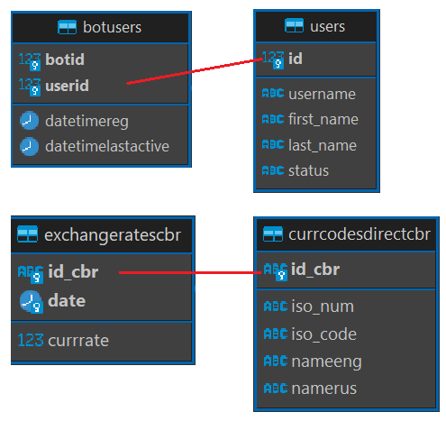

# CBR Telegram Bot

[](README.md)
[](README.en.md)

Telegram-бот для получения данных с официального сайта ЦБ РФ. Поддерживает функциональность по конвертации валют, получению курсов валют, ключевой ставки и оперативной информации.


## Оглавление
- [CBR Telegram Bot](#cbr-telegram-bot)
  - [Оглавление](#оглавление)
  - [Особенности](#особенности)
  - [Структура проекта](#структура-проекта)
  - [Структура БД](#структура-бд)
    - [Таблица _Users_](#таблица-users)
    - [Таблица _BotUsers_](#таблица-botusers)
    - [Таблица _CurrCodesDirectCBR_](#таблица-currcodesdirectcbr)
    - [Таблица _ExchangeRatesCBR_](#таблица-exchangeratescbr)
  - [Установка и запуск](#установка-и-запуск)
    - [1. Клонирования репозитория и установка зависимостей:](#1-клонирования-репозитория-и-установка-зависимостей)
    - [2. Настройка конфигураций _(.env)_](#2-настройка-конфигураций-env)
    - [3. Запуск бота](#3-запуск-бота)
  - [Перечень команд](#перечень-команд)
    - [Примеры использования](#примеры-использования)
  - [Примечание](#примечание)
  - [Лицензия](#лицензия)
  - [Контрибьютинг](#контрибьютинг)


## Особенности
:exclamation: Для работы данного бота необходимо подключение базы данных PostgreSQL.
- При запуске проекта создается структура БД PostgreSQL необходимая для работы бота  
  ***(если структура уже существует, этот этап пропускается)***
- Бот работает в приоритете с данными PostgreSQL.  
  В случае отсутствия информации в базе данных, бот запрашивает данные с сайта ЦБ РФ и дополняет недостающую информацию.
- Данные по курсу валют заполняются в БД исключительно по запросу (курса, конвертации) на указанную дату.
- Данные по оперативной информации берутся исключительно с сайта ЦБ, без сохранения в БД, и являются ссылками на соответствующий источник.


## Структура проекта
| Файл                  | Описание                                                        |
|-----------------------|-----------------------------------------------------------------|
| .env                  | Переменные окружения: токен бота и параметры для подключения БД |
| databases.py          | Подключение и работа с БД PostgreSQL                            |
| CBR_Exceptions.py     | Класс для обработки исключений                                  |
| extensions.py         | Основная функциональность, парсинг, работа с API                |
| requirements.txt      | Перечень зависимостей                                           |
| structure_database.py | Создание структуры БД                                           |
| run.py                | Запуск бота, обработчики команд, клавиатуры                     |
| README.md             | Документация на русском                                         |
| README.en.md          | Документация на английском                                      |
| .gitignore            | Игнорирование временных файлов                                  |
| LICENSE               | Лицензия                                                        |


## Структура БД
|Таблица              | Наименование               |
|---------------------|----------------------------|
| Users               | Пользователи               |
| BotUsers            | Связь бота и пользователей |
| CurrCodesDirectCBR  | Коды валют                 |
| ExchangeRatesCBR    | Курсы валют                |

<p align="left">
 
</p>


### <u>Таблица _Users_</u>
  |Поле         | Наименование            |
  |-------------|-------------------------|
  | ID          | ID пользователя         |
  | UserName    | Пользователь телеграм   |
  | First_Name  | Имя                     |
  | Last_Name   | Фамилия                 |
  | Status      | Статус (для блокировки) |

### <u>Таблица _BotUsers_</u>
  |Поле                 | Наименование                      |
  |---------------------|-----------------------------------|
  | BotID               | ID бота                           |
  | UserID              | ID пользователя                   |
  | DateTimeReg         | Регистрации пользователя          |
  | DateTimeLastActive  | Последняя активность пользователя |

### <u>Таблица _CurrCodesDirectCBR_</u>
  |Поле       | Наименование                     |
  |-----------|----------------------------------|
  | ID_CBR    | ID валюты ЦБ РФ                  |
  | ISO_num   | ID  валюты ISO                   |
  | ISO_code  | Коды валюты ISO                  |
  | NameEng   | Наименование валюты (английский) | 
  | NameRus   | Наименование валюты (русский)    | 

### <u>Таблица _ExchangeRatesCBR_</u>
  |Поле       | Наименование        |
  |-----------|---------------------|
  | ID_CBR    | ID валюты ЦБ РФ     |
  | Date      | Дата курса          |
  | CurrRate  | Курс валюты к рублю |


## Установка и запуск

### 1. Клонирования репозитория и установка зависимостей:
    git clone https://github.com/NikPACodes/CBR_TelBot.git
    cd CBR_TelBot
    pip install -r requirements.txt

или для дальнейшей разработки в собственном репозитории создавайте [Fork](https://github.com/NikPACodes/CBR_TelBot/fork)

    git clone https://github.com/yourusername/CBR_TelBot.git
    cd CBR_TelBot
    pip install -r requirements.txt

### 2. Настройка переменных окружения _(.env)_
- Необходимо заполнить файл _.env_ следующими данными:
  ```
  TOKEN = '*****'
  DB_NAME = '*****'
  DB_USER = '*****'
  DB_PASSWORD = '*****'
  DB_HOST = '*****'
  DB_PORT = '*****'
  ```

  |Параметр       | Описание                   |
  |---------------|----------------------------|
  | _TOKEN_       | Личный токен бота телеграм |
  | _DB_NAME_     | Наименование БД            |
  | _DB_USER_     | Пользователь БД            |
  | _DB_PASSWORD_ | Пароль                     |
  | _DB_HOST_     | Хост                       |
  | _DB_PORT_     | Порт                       |


### 3. Запуск бота
    python run.py

## Перечень команд
1) ***/help*** - Список доступных команд 
2) ***/current_codes*** - Справочник доступных кодов валют
3) ***/find_name_code*** - Поиск кода валюты по названию
4) ***/oper_info*** - Оперативная информация  
  (по категориям: "Денежно-кредитная политика", "Решения Банка России","Статистика", "Аналитика", "База данных", "Исследования")
1) ***/convert*** - Конвертер валют
2) ***/current_rate*** - Курс валют ЦБ
3) ***/key_rate*** - Ключевая ставка ЦБ

### Примеры использования
- **/find_name_code**  
  ```Примеры: RUB, rub, рубл```

- **/convert**  
  ```
  Примеры (по умолчанию USD/RUB):
  1) 100 - конвертация USD в RUB
  2) 100 EUR - конвертация EUR в RUB
  3) 1000 USD/EUR - конвертация USD в EUR
  4) 01.01.2001 1000 EUR - конвертация EUR в RUB по курсу 01.01.2001
  5) 01.01.2001 1000 USD/EUR - конвертация USD в EUR по курсу 01.01.2001
  ```

- **/current_rate**
  ```
  Пример (по умолчанию на последнюю доступную дату):
  1) USD - курс USD к RUB
  2) USD/EUR - курс USD к EUR
  3) 01.01.2001 USD - курс USD к RUB на указанную дату
  4) Все или ALL - вывести курсы всех валют к RUB
  ```


## Примечание
Основная цель данного бота - это создание шаблона для дальнейшей реализации более сложных проектов, с более интересным функционалом.  
В дальнейшем будет расширения функционала данного шаблона в части:
- Добавление поддержки других баз данных (MySQL, Redis)
- Добавления оповещений
- Проверка статусов и автоматическое блокирование пользователей
- Логирование работы ПО
- Доработка автоматизации обновления БД
- Добавление Mini Apps


## Лицензия
MIT License — свободно используйте, меняйте и распространяйте проект с упоминанием авторства.


## Контрибьютинг
1. Приветствуются любые улучшения — от исправлений багов до новых функций!
2. Перед пушем убедитесь, что ваши изменения не ломают основную функциональность.
3. Создайте pull request или [issues](https://github.com/NikPACodes/CBR_TelBot/issues) для обсуждения.
4. Для собственного развития проекта или использования в качестве шаблона создавайте [Fork](https://github.com/NikPACodes/CBR_TelBot/fork) в свой репозиторий
